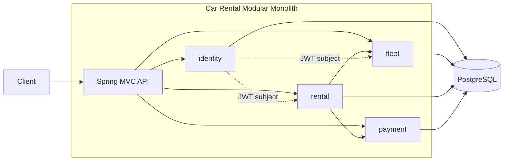
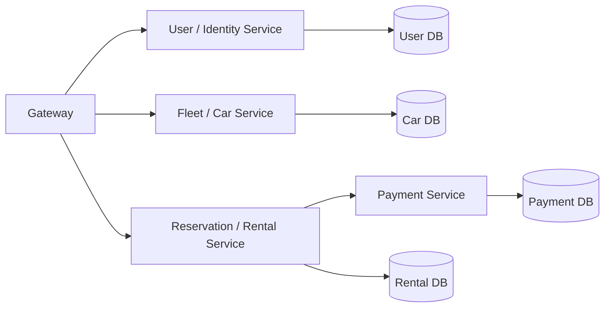
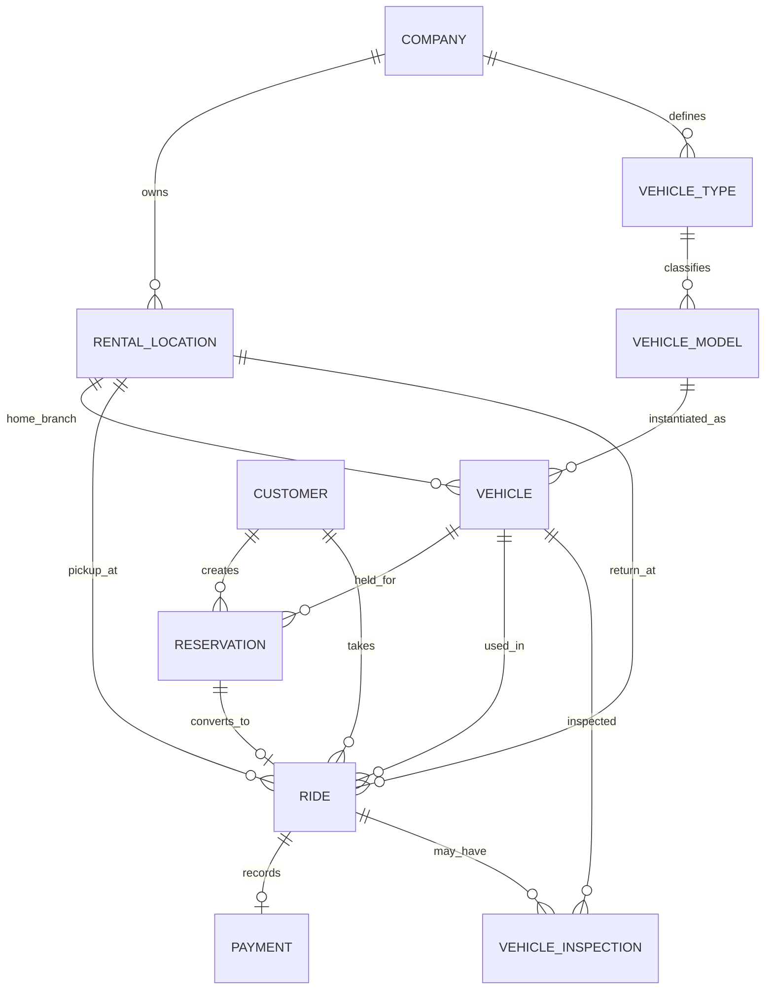

# Architecture

The application is a **modular monolith**: one deployable image and one PostgreSQL database, with package boundaries aligned to future services.

Future extraction target:

## Entity relationships

## Reservation concurrency

The reservation endpoint requires `Idempotency-Key`.

Within one PostgreSQL transaction:

1. Acquire a transaction-scoped PostgreSQL advisory lock derived from `(customer_id, idempotency_key)`.
2. Replay an existing reservation only when type, start time, and duration match.
3. Find candidate vehicles for the requested `CarType` enum.
4. Lock candidate `vehicle` rows with `SELECT ... FOR UPDATE`.
5. Reject candidates with an overlapping `HELD` or `CONVERTED` reservation.
6. Assign a vehicle and persist the requested start, end, and number of days.

The advisory lock serializes concurrent replays of the same idempotency key. Vehicle row locks serialize competition for finite type inventory. The unique database constraint on `(customer_id, idempotency_key)` remains the final integrity guard.

Period overlap uses half-open intervals, so adjacent reservations can safely reuse one vehicle.

## Ride completion transaction

Finishing a ride locks the ride and vehicle, validates an active return branch, computes the fixed daily charge on the server, records the return branch, moves the vehicle to that branch, and inserts the payment record in one PostgreSQL transaction. This keeps the ride, fleet location and payment record ACID-consistent.

Cancellation is a reservation-only transition. A ride is created in `ACTIVE` state only when a reservation starts; from there its only supported terminal transition is `FINISHED`.
