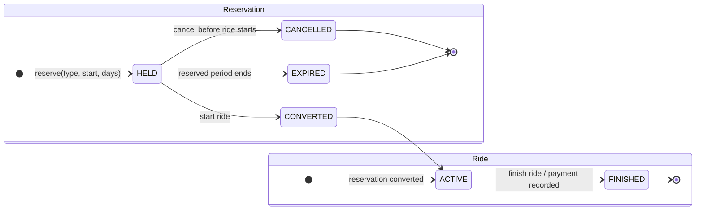

# Rental state flow

Rules:

- A customer may cancel only while the reservation is `HELD`; no ride or payment exists yet.
- Starting converts the reservation to `CONVERTED` and creates an `ACTIVE` ride.
- There is no ride-cancellation endpoint: a ride exists only after it has started and must then be finished.
- Finishing an `ACTIVE` ride changes it to `FINISHED`, returns the vehicle, calculates billed days, and records payment atomically.
- The reservation cleanup job changes elapsed `HELD` reservations to `EXPIRED`.
